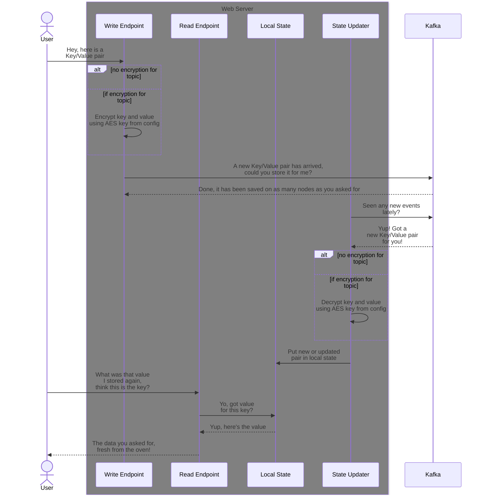
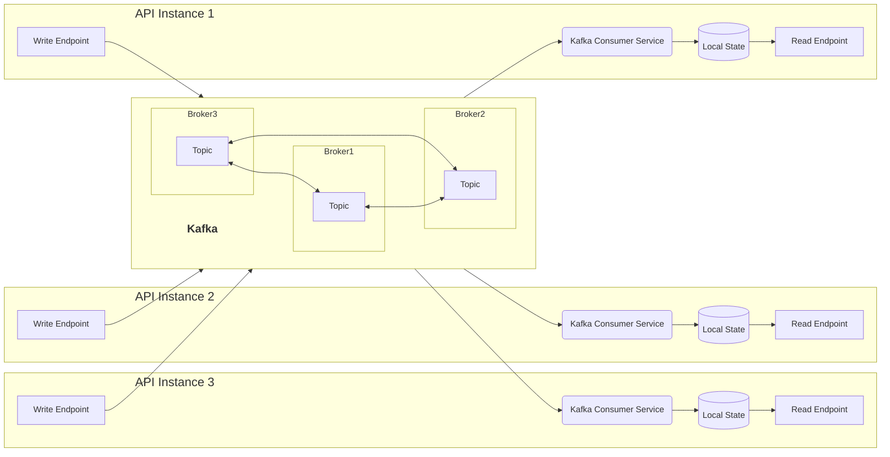

# About

A demo of a simple distributed service that allows you to store and retrieve
key-value pairs using a web/REST/http API.

## What does it do

It sets up a dotnet web server, that allows you to send in data you want to store.
Upon submission, the data is immediately dispatched to a [Kafka](https://developer.confluent.io/what-is-apache-kafka/) topic.
Then there is another background process listens for new events on the Kafka topic,
which it uses to update the local state which is used when the data is requested.

<details>
<summary style="font-size: 1.5em">Process flow illustration</summary>



</details>

This allows you to run as many parallel instances as you need/have the resources to
(given that you give them separate Kafka Consumer Groups).

<details>
<summary style="font-size: 1.5em">Main components illustration</summary>



</details>

If you don't care for using this API to add data, you can also point it to pretty much
any Kafka topic where the key and value can be read as strings. It will strip any
leading [Kafka schema magic bytes](https://docs.confluent.io/platform/current/schema-registry/fundamentals/serdes-develop/index.html#wire-format) preceding the data if present, and happily serve it out as string.

## Why

Primarily to illustrate that it's fairly trivial to get a distributed key value store
up and running if you've got a Kafka cluster laying around.

However, I also wanted to play around with encryption, and file storage, and challenge
myself to see how simple I could make it.

While this is a simplistic web API, I expect the code to find more use for
internal application usage for distributing state between nodes.

## Configurations

Im mem vs on disk
(Can be interesting win on disk in mem/ramdisk in kubernetes for effectively encrypted in mem storage, but then again with key in same memory, why?)
Plaintext vs encrypted on topic

For configuring the connection to your Kafka cluster beyond the basics, see config settings supported by this utility and the environment variable names [in the KafkaConfig directory in the project](./Code/KeyValueApi/KafkaConfig/README.md#supported-variables) (should be everything per the 2.2.0 dotnet Kafka packages).

<details>
<summary>Baseline .NET configuration</summary>
Not really necessary, byt nice for quality of life

| Variable | Example value | What |
|----------|---------------|------|
| [ASPNETCORE_ENVIRONMENT](https://learn.microsoft.com/en-us/aspnet/core/fundamentals/environments?view=aspnetcore-8.0) | `Development` | Allows you to set `Development` as the environment, which enables some niceties for local development like error pages that are not useless but have lots of detail. |
| [ASPNETCORE_URLS](https://learn.microsoft.com/en-us/aspnet/core/fundamentals/configuration/?view=aspnetcore-8.0#kestrel-endpoint-configuration) | `http://+:8080` | Allows you to specify what ports you'll be running on, and whether to enable https at all (seeing as it's mostly terminated for you by the infrastructure of the day no reason to produce lots of "browser hates your certificate" noise when hosting locally in compose) |
| [LOGGING__LOGLEVEL__DEFAULT](https://learn.microsoft.com/en-us/aspnet/core/fundamentals/logging/?view=aspnetcore-8.0) | `Trace` | Sets the default log level used by your code (and everything else unless you configure other components individually). |
| [LOGGING__LOGLEVEL__MICROSOFT](https://learn.microsoft.com/en-us/aspnet/core/fundamentals/logging/?view=aspnetcore-8.0) | `Warning` | Sets the log level of Microsoft components (which allows you to control the degree of log output not originating from your code, which is nice when you don't feel like setting up and navigating a log processing engine for quickly checking something out) |
| [LOGGING__LOGLEVEL__MICROSOFT.ASPNETCORE.DATAPROTECTION](https://learn.microsoft.com/en-us/aspnet/core/security/data-protection/configuration/overview?view=aspnetcore-8.0) | `Error` | Allows you to configure Microsofts protection of session keys etc. Carefully consider this if you run in a shared hosting environment. But also beware that alle the security of assets the application has access to like Kafka security settings and the storage keys (or storage itself if running in memory) will leak if someone takes a memory dump of the application or snapshot of the disk system accessible by the application user. So the default in memory storage that Microsofts web framework set up, which it warns about being insecure during startup, well, it's up to you to figure how much of humanitys time to spend on it when you'll probably run this in a container at a place you have no choice but to blindly trust that doesn't abuse the secrets you provide for the solution to start running at all |

</details>

<br>

<details>
<summary>Baseline Kafka configuration</summary>
A minimal configuration for the connection to Kafka

| Variable                        | Required | Example Value | Comment |
|---------------------------------|----------|---------------|---------|
| KAFKA_BOOTSTRAP_SERVERS         | required | `172.80.80.11:9092,172.80.80.12:9092,172.80.80.13:9092` | The addresses your application instances use to find your Kafka cluster |
| KAFKA_SECURITY_PROTOCOL         | required | `ssl` | What kind of security is used when connecting to kafka (main options are none, username/password, certificates, tokens) |
| KAFKA_SSL_CA_PEM_LOCATION       | optional | `/kafka/secrets/ca.crt` | The location of the file containing the certificates of the CAs you expect to have signed the brokers certificates so that you can trust them when connecting to them. Another alternative might be embedding the CA Certificates in the machines trust store or using certificates by a CA that is widely trusted and already embedded. |
| KAFKA_SSL_CERTIFICATE_LOCATION  | optional | `/kafka/secrets/acl-principal.crt` | When running with `ssl` as the security mode (certificate authentication), specifies where the applications certificate can be found. |
| KAFKA_SSL_KEY_LOCATION          | optional | `/kafka/secrets/acl-principal.key` | When running with `ssl` as the security mode (certificate authentication), specifies where the applications private key (corresponding to it's certificate) can be found. |
| KAFKA_SSL_KEY_PASSWORD_LOCATION | optional | `/kafka/secrets/password.txt` | When running with `ssl` as the security mode (certificate authentication), if the provided key is encrypted, specifies where to find the password that can be used to decrypt it |
| KAFKA_ACKS                      | optional | `leader` | Specifies whether the producer should wait for `all` the brokers keeping replicas to confirm they've persisted the event, just the `leader` the application is connected to, or `none` to fire and forget the message. |
| KAFKA_GROUP_ID                  | required | `key-value-api-instance` | The consumer group this instance should use when connecting to Kafka when retrieving events. Beware that if you set up multiple instances to use the same group, only one of them will be getting the events. |
| KAFKA_ENABLE_AUTO_COMMIT        | optional | `true` | Whether to store/commit the offset that has been consumed to the consumer group. Not used by the application, but useful in that it allows monitoring the group to see how far the application has come or if it's falling behind. |
| KAFKA_AUTO_COMMIT_INTERVAL_MS   | optional | `200` | How often to store the consumed offsets back into the consumer group. |
| KAFKA_SCHEMA_REGISTRY_URL       | required | `http://172.80.80.10:8083` | The address of the [Schema Registry](https://developer.confluent.io/courses/apache-kafka/schema-registry/) associated with the Kafka cluster. Used to determine whether there are schemas associated with the topics read from. |
| KV_API_KAFKA_KEY_VALUE_TOPIC    | required | `key-value-store` | The topic with the keys and values you want to serve out/ingest to. |

</details>

<br>

<details open>
<summary>App behaviour configuration</summary>

| Config key | possible values | Comment |
|------------|-----------------|---------|
| KV_API_STATE_STORAGE_TYPE | <ul><li>`"sqlite"`</li><li>`"disk"`</li><li>`"dict"`</li><li>not set</li></ul> | If read has not been disabled by setting the `KV_API_DISABLE_READ` environment variable, this will determine what kind of local storage is used. If `"dict"` is selected, an plain dotnet dictionary in memory is used. If `"disk"` is selected, the application stores the local lookup state as files directly on the file system where it's running. If `"sqlite"` is selected, it runs an SQLite DB instance either in memory, or on disk if the `KV_API_STATE_STORAGE_DISK_LOCATION` environment variable has been set. If no value/any other value has been set, the application defaults to using the settings as if `"sqlite"` had been selected. |
| KV_API_STATE_STORAGE_DISK_LOCATION | string path to storage location on disk | If `KV_API_STATE_STORAGE_TYPE` is set to `"sqlite"`, SQLite defaults to running in memory. If it is set to a directory, a new SQLite database file is created in the directory. If it points to an existing file, SQLite will assume it's its database. Otherwise, if If `KV_API_STATE_STORAGE_TYPE` is set to `"disk"`, it will use this as the base directory for storage. |
| KV_API_STATE_STORAGE_SQLITE_PASSWORD | string password | If SQLite set to persist to disk, sets the password for encrypting the database |
| KV_API_ENCRYPT_DATA_ON_KAFKA | <ul><li>`"true"`</li><li>not set</li></ul> | Whether the data that goes to/comes from Kafka is encrypted. Affects both producing and consuming. If set, you also have to specify the key in the `KV_API_AES_KEY` config variable |
| KV_API_AES_KEY | 64 hex characters (`0-9a-fA-F`, 256 bits) | If encrypting the data on the topic, set the key here. Only used if the `KV_API_ENCRYPT_DATA_ON_KAFKA` environment variable has been set to `"true"`. |
| KV_API_DISABLE_WRITE | <ul><li>`"true"`</li><li>`"false"`</li><li>not set</li></ul> | If you don't want to enable the possibility to write from this insane (making it a read only instance), you can set this to `"true"`. |
| KV_API_DISABLE_READ | <ul><li>`"true"`</li><li>`"false"`</li><li>not set</li></ul> | If you don't want to enable the possibility to read from this insane (making it a write only instance), you can set this to `"true"`. |


</details>

### Notes on deletion

By default retains data indefinitely on topic when the topic is configured like
in the docker compose with these settings

| Topic config setting                                                                                                        | Value  |
|-----------------------------------------------------------------------------------------------------------------------------|--------|
| [cleanup.policy](https://docs.confluent.io/platform/current/installation/configuration/topic-configs.html#cleanup-policy)   | delete |
| [retention.bytes](https://docs.confluent.io/platform/current/installation/configuration/topic-configs.html#retention-bytes) | -1     |
| [retention.ms](https://docs.confluent.io/platform/current/installation/configuration/topic-configs.html#retention-ms)       | -1     |

If you want the delete events to be gone from Kafka as well as the API
when you delete them, you have to configure the topic to do compaction
(preferably when creating it).
https://docs.confluent.io/kafka/design/log_compaction.html
To effectively achieve this, set at least these

| Topic config setting                                                                                                                            | Value    |
|-------------------------------------------------------------------------------------------------------------------------------------------------|----------|
| [cleanup.policy](https://docs.confluent.io/platform/current/installation/configuration/topic-configs.html#cleanup-policy)                       | compact  |
| [retention.bytes](https://docs.confluent.io/platform/current/installation/configuration/topic-configs.html#retention-bytes)                     | -1       |
| [retention.ms](https://docs.confluent.io/platform/current/installation/configuration/topic-configs.html#retention-ms)                           | -1       |
| [min-compaction-lag-ms](https://docs.confluent.io/platform/current/installation/configuration/topic-configs.html#min-compaction-lag-ms)         | 900000   |
| [max.compaction.lag.ms](https://docs.confluent.io/platform/current/installation/configuration/topic-configs.html#max-compaction-lag-ms)         | 3600000  |
| [segment.ms](https://docs.confluent.io/platform/current/installation/configuration/topic-configs.html#segment-ms)                               | 7200000  |
| [delete.retention.ms](https://docs.confluent.io/platform/current/installation/configuration/topic-configs.html#delete-retention-ms)             | 86400000 |
| [min.cleanable.dirty.ratio](https://docs.confluent.io/platform/current/installation/configuration/topic-configs.html#min-cleanable-dirty-ratio) | 0.90     |

If you additionally want to set the topic to not only remove deleted events
so that they can never be replayed, and also say delete everything after
a given time span (say it's very important for you that data disappears after 5 years),
you can also set the `cleanup.policy` to `compact,delete`, where it will both compact
the topic according to your settings, and also perform the deletion.

# (Building and) Running it

## Prerequisites

Technically, you only need the `dotnet-sdk`, `dotnet-runtime` and `aspnet-runtime` installed ([Windows/directly from Microsoft](https://dotnet.microsoft.com/en-us/download), [arch](https://wiki.archlinux.org/title/.NET), [MacOs](https://formulae.brew.sh/formula/dotnet)), and access to a [Kafka](https://en.wikipedia.org/wiki/Apache_Kafka) cluster somewhere.

However, if you just want to run everything locally on your dev machine I strongly recommend just spinning up the docker composes in this repository as described below.

For that you will need Docker Compose, which you can find here:

Docker compose: https://docs.docker.com/compose/install/

Beyond that I recommend using VisualStudio Code, with the REST Client extension so you can easily poke the API with the provided HTTP files.

VS Code: https://code.visualstudio.com/
VS Code REST Client: https://marketplace.visualstudio.com/items?itemName=humao.rest-client

## Steps (docker compose)

1. Start the [docker compose in the top level directory](./docker-compose.yaml),
  besides this readme, to initialize all the required infrastructure components,
  configure them, and spin up their associated supporting tools (KafkaUI) for smoother local development.
2. After the infrastructure has spun up, start the [docker compose in the `Code/`](./Code/docker-compose.yaml)
  directory, to start the actual service.
3. Once it's up and running, you can use the http requests in the [`Code/usage.http`](./Code/usage.http)
  to check out the functionality.

Once everything is up and running here is where you'll find the most interesting starting points

| What                                              | Where                  |
|---------------------------------------------------|------------------------|
| The APIs Write endpoint                           | /store                 |
| The APIs Read endpoint                            | /retrieve              |
| The APIs Delete endpoint                          | /remove                |
| Endpoint for submitting everything as base64      | /store/b64             |
| Endpoint for fetching everything as base64        | /retrieve/b64          |
| Health check: Startup                             | /healthz               |
| Health check: Readiness                           | /healthz/ready         |
| Health check: Liveliness                          | /healthz/live          |
| [Kafka UI](https://github.com/provectus/kafka-ui) | http://localhost:8081/ |

# Retracing the creation steps

Creation steps in case of demo or similar

```shell
dotnet new gitignore
dotnet new editorconfig
dotnet new sln --name "KeyValueApi"
dotnet new webapi --name "WebApi" --output "WebApi"
dotnet sln add WebApi/WebApi.csproj
cd WebApi/

echo "Add packages for Kafka"
dotnet add package Confluent.Kafka
dotnet add package Confluent.SchemaRegistry
dotnet add package Confluent.SchemaRegistry.Serdes.Json

echo "Add packages for encrypted SQLite"
echo "(If you don't need it don't add these two, instead only add Microsoft.Data.Sqlite )"
dotnet add package Microsoft.Data.Sqlite.Core
dotnet add package SQLitePCLRaw.bundle_e_sqlcipher

dotnet add package System.IO.Hashing
```

# External resources

- Kafka dotnet client documentation: https://docs.confluent.io/platform/current/clients/confluent-kafka-dotnet/_site/api/Confluent.Kafka.html
- Compose file specification: https://docs.docker.com/compose/compose-file/05-services/
- Microsoft SQLite integration documentation: https://learn.microsoft.com/en-us/dotnet/standard/data/sqlite/?tabs=net-cli
